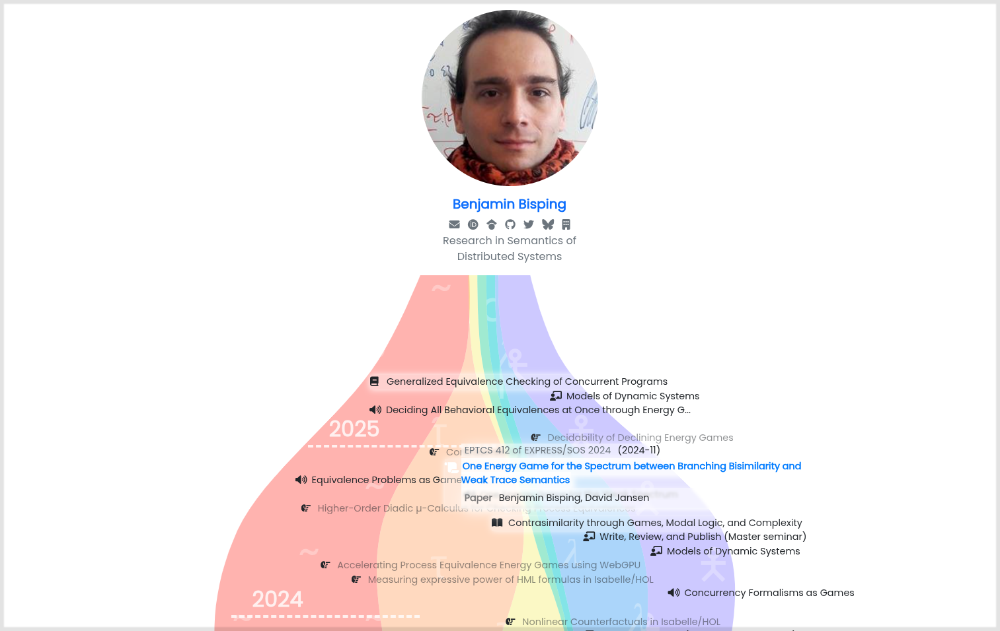

# Showcase: Academic works of Benjamin Bisping

Live on https://bbisping.de

[](https://bbisping.de)

## How to build

Needs `npm` for dependencies / building:

```
npm install
npm run ruby-deps
npm run build
```

This will render a Jekyll site to `./_site/`.

To start up a local dev server:

```
npm run dev
```

## Credits

Theme based on Youssef Raafat's [portfolYOU](https://github.com/YoussefRaafatNasry/portfolYOU).
